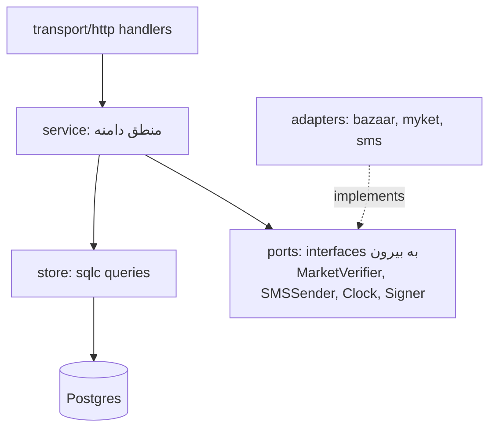
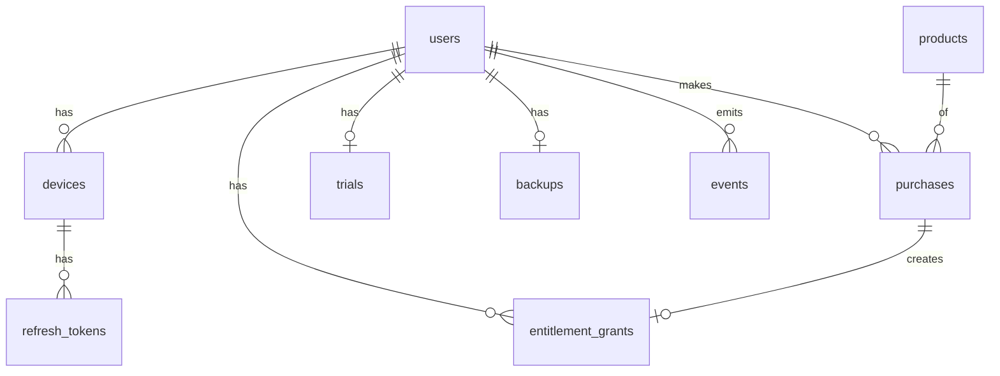

# ۱۰ — معماری بک‌اند (Go)

## ۱. نقش سرور
سرور **منبع حقیقت داده‌ی روزانه‌ی کاربر نیست** (آن روی دستگاه است). مسئولیت‌ها:
1. هویت ناشناس دستگاه و توکن‌ها
2. Entitlement: تریال، تأیید خرید، صدور وضعیت امضاشده
3. Remote config و experiments
4. Content packs (متن‌ها، تمرین‌ها، ماجراجویی‌ها، آیتم‌ها)
5. دریافت analytics
6. Backup رمزنگاری‌شده (فاز ۲)
7. Admin حداقلی

## ۲. پشته فنی
| لایه | انتخاب | دلیل |
|---|---|---|
| زبان | Go ≥ 1.23 | قید پروژه |
| HTTP | `net/http` با `ServeMux` الگو-محور + middleware داخلی | بدون framework؛ Go 1.22+ متد و پارامتر مسیر دارد |
| DB | PostgreSQL 16 | رابطه‌ای، JSONB برای config، partitioning برای events |
| دسترسی DB | `pgx/v5` + `sqlc` | type-safe، بدون ORM |
| مهاجرت | `goose` (فایل‌های SQL) | ساده، up/down |
| لاگ | `log/slog` (JSON) | stdlib |
| متریک | `prometheus/client_golang` در `/metrics` (فقط شبکه داخلی) | خودمیزبان |
| پیکربندی | env vars (12-factor) + `envconfig`-مانند داخلی | بدون فایل secret در image |
| امضا | `crypto/ed25519` | توکن entitlement و JWT |
| تست | `testing` + `testcontainers-go` (Postgres) | تست یکپارچه واقعی |
| لینت | `golangci-lint` (govet, staticcheck, errcheck, gosec, revive) | — |

## ۳. لایه‌بندی و قواعد وابستگی
هر ماژول: `transport (http)` ← `service` ← `store (sqlc)`. ماژول‌ها فقط از طریق **interface عمومی service** هم را صدا می‌زنند؛ دسترسی مستقیم به جدول ماژول دیگر ممنوع.



## ۴. ساختار پوشه
```
backend/
  cmd/
    api/            # main سرور HTTP
    migrate/        # اجرای goose
    worker/         # jobهای زمان‌بندی‌شده (re-verify اشتراک، پاک‌سازی، partition)
    admin-cli/      # انتشار config/content از فایل
  internal/
    platform/
      config/       # بارگذاری env
      db/           # pool، tx helper
      httpx/        # router، middleware (request_id، recover، auth، ratelimit، logging)، خطای استاندارد
      log/          # slog setup
      metrics/
      signer/       # Ed25519 sign/verify، kid rotation
      clock/
    modules/
      auth/         # device register، refresh، (فاز۲) phone OTP
      user/         # profile حداقلی، حذف حساب
      entitlement/  # grants، trial، وضعیت امضاشده
      billing/      # تأیید خرید، products، purchases؛ ports: MarketVerifier
        bazaar/     # adapter [نیاز به راستی‌آزمایی]
        myket/      # adapter [نیاز به راستی‌آزمایی]
      remoteconfig/ # config docs، experiments، bucketing
      content/      # manifest و packs
      analytics/    # ingest batch
      backup/       # (فاز۲) blob رمزنگاری‌شده
      admin/        # endpointهای admin
  db/
    migrations/     # 0001_init.sql ...
    queries/        # *.sql برای sqlc
  api/
    openapi.yaml    # قرارداد منبع (از روی این سند)
  deploy/
    docker-compose.yml, Caddyfile, Dockerfile
  config-data/      # JSONهای config و content نسخه‌دار (در گیت)
```

## ۵. مدل داده
همه IDها `uuid` (UUIDv7 تولید در اپلیکیشن)، همه زمان‌ها `timestamptz` (UTC).

### ۵.۱ auth / user
| جدول | فیلدها | نکته |
|---|---|---|
| `users` | `id`, `created_at`, `status` (`active`/`deleted`), `phone_e164` (nullable, unique, فاز۲), `phone_verified_at`, `deleted_at` | بدون نام/ایمیل |
| `devices` | `id`, `user_id` FK, `install_id` (unique), `device_hash` (sha256 از ANDROID_ID + salt سرور), `market` (`bazaar`/`myket`), `app_version`, `os_version`, `model`, `created_at`, `last_seen_at` | |
| `refresh_tokens` | `id`, `device_id` FK, `token_hash` (sha256), `family_id`, `expires_at`, `revoked_at`, `created_at` | rotation + تشخیص reuse |
| `otp_challenges` (فاز۲) | `id`, `phone_e164`, `code_hash`, `attempts`, `expires_at`, `consumed_at` | |

### ۵.۲ entitlement / billing
| جدول | فیلدها | نکته |
|---|---|---|
| `products` | `id` (مثلاً `premium_3m`), `kind` (`subscription`/`pass`/`consumable`), `entitlement` (`premium`/null), `duration_days`, `coins_amount`, `market`, `market_sku`, `active` | نگاشت SKU مارکت |
| `purchases` | `id`, `user_id`, `device_id`, `market`, `product_id`, `market_order_id`, `purchase_token_hash`, `purchase_token_enc` (رمزشده)، `state` (`pending`/`verified`/`invalid`/`refunded`/`expired`/`canceled`), `purchased_at`, `verified_at`, `expires_at`, `auto_renewing`, `raw_response` JSONB | unique(`market`,`purchase_token_hash`) ← جلوگیری از استفاده مجدد توکن |
| `entitlement_grants` | `id`, `user_id`, `entitlement` (`premium`), `source` (`trial`/`subscription`/`pass`/`promo`), `purchase_id` (nullable), `starts_at`, `ends_at`, `revoked_at`, `created_at` | entitlement فعال = grant با `starts_at ≤ now < ends_at` و `revoked_at IS NULL` |
| `trials` | `id`, `user_id`, `device_hash` (unique), `started_at`, `ends_at` | یک تریال per `device_hash` |

### ۵.۳ remote config / content
| جدول | فیلدها |
|---|---|
| `config_versions` | `id`, `version` (int، افزایشی), `payload` JSONB, `min_app_version`, `published_at`, `published_by`, `is_active` |
| `experiments` | `key` PK, `status` (`draft`/`running`/`stopped`), `variants` JSONB (`[{name, weight, overrides}]`), `audience` JSONB, `started_at`, `stopped_at` |
| `content_packs` | `id`, `pack_key` (`copy_fa`, `exercises`, `adventures`, `shop_items`, `seasonal_yalda` ...), `version`, `locale`, `payload` JSONB, `sha256`, `min_app_version`, `published_at`, `is_active` |

### ۵.۴ analytics
| جدول | فیلدها |
|---|---|
| `events` (partition ماهانه بر `received_at`) | `id`, `user_id`, `install_id`, `name`, `props` JSONB, `client_ts`, `received_at`, `app_version`, `market`, `session_id` |
| `daily_metrics` (materialized/rollup توسط worker) | `day`, `metric`, `dims` JSONB, `value` |

### ۵.۵ backup (فاز ۲)
| جدول | فیلدها |
|---|---|
| `backups` | `user_id` PK, `blob_ref` (کلید object storage یا bytea اگر < 5MB), `size_bytes`, `schema_version`, `sha256`, `kdf_params` JSONB, `updated_at` |



## ۶. قرارداد API (v1)
- Base: `https://api.{domain}/v1`، JSON، `snake_case`.
- هدرهای الزامی کلاینت: `X-App-Version`, `X-Market`, `X-Install-Id`, `Accept-Language: fa`.
- احراز: `Authorization: Bearer <access_token>` به‌جز endpointهای `public`.
- فرم خطا:
```
{ "error": { "code": "TRIAL_ALREADY_USED", "message": "...", "request_id": "..." } }
```

### ۶.۱ Endpointها
| متد | مسیر | Auth | ورودی | خروجی | خطاها |
|---|---|---|---|---|---|
| GET | `/healthz` | public | — | `{status}` | — |
| GET | `/readyz` | public | — | `{status, db}` | 503 |
| POST | `/v1/auth/device` | public | `install_id`, `device_hash_raw` (ANDROID_ID؛ سرور با salt هش می‌کند), `market`, `app_version`, `os_version`, `model` | `user_id`, `access_token`, `access_expires_at`, `refresh_token` | `INVALID_INPUT`, `RATE_LIMITED` |
| POST | `/v1/auth/refresh` | public | `refresh_token` | همان بالا (refresh جدید) | `TOKEN_INVALID`, `TOKEN_REUSED` |
| POST | `/v1/auth/phone/otp` (فاز۲، پرامپت 05) | bearer | `phone` | `challenge_id`, `retry_after_s` | `RATE_LIMITED`, `PHONE_INVALID` |
| POST | `/v1/auth/phone/verify` (فاز۲) | bearer | `challenge_id`, `code` | `user_id` (ممکن است به کاربر قبلی merge شود), توکن‌های جدید | `OTP_INVALID`, `OTP_EXPIRED` |
| GET | `/v1/me` | bearer | — | `user_id`, `created_at`, `phone_linked` | — |
| DELETE | `/v1/me` | bearer | — | 204 | — |
| GET | `/v1/entitlements` | bearer | — | `EntitlementState` (پایین) | — |
| POST | `/v1/trial/start` | bearer | `provisional_started_at` (اختیاری، اگر آفلاین شروع شده) | `EntitlementState` | `TRIAL_ALREADY_USED`, `TRIAL_DISABLED` |
| POST | `/v1/purchases/verify` | bearer | `market`, `product_id`, `market_sku`, `purchase_token`, `order_id` | `purchase_state`, `EntitlementState`, `coins_granted` | `PURCHASE_INVALID`, `PURCHASE_ALREADY_CLAIMED`, `MARKET_UNAVAILABLE` (503، کلاینت retry) |
| POST | `/v1/purchases/restore` | bearer | `market`, `purchases: [{product_id, market_sku, purchase_token, order_id}]` | `EntitlementState` | `MARKET_UNAVAILABLE` |
| GET | `/v1/config` | bearer یا public با `X-Install-Id` | query: `known_version` | `ConfigResponse`؛ `304` با `ETag` | — |
| GET | `/v1/content/manifest` | public | — | `{packs: [{pack_key, version, sha256, size, min_app_version, url}]}` + ETag | — |
| GET | `/v1/content/packs/{pack_key}/{version}` | public | — | payload pack (gzip، cache طولانی، immutable) | 404 |
| POST | `/v1/events` | bearer | `{events: [Event], sent_at}` حداکثر ۲۰۰ رویداد / ۲۵۶KB | `{accepted, rejected}` | `PAYLOAD_TOO_LARGE` |
| PUT | `/v1/backup` (فاز۲) | bearer | body: blob باینری؛ هدر `X-Backup-Schema`, `X-Backup-Sha256`, `X-Kdf-Params` | `{updated_at}` | `BACKUP_TOO_LARGE` (حداکثر ۱۰MB) |
| GET | `/v1/backup` (فاز۲) | bearer | — | blob + هدرها | 404 |
| DELETE | `/v1/backup` (فاز۲) | bearer | — | 204 | — |

### ۶.۲ ساختارهای مشترک
**EntitlementState**
| فیلد | نوع | توضیح |
|---|---|---|
| `entitlements` | `[{key: "premium", source, starts_at, ends_at}]` | فعال‌ها |
| `trial` | `{eligible: bool, used: bool, ends_at}` | |
| `server_time` | timestamp | برای اصلاح ساعت کلاینت |
| `valid_until` | timestamp | زمان انقضای اعتبار offline این سند = `min(ends_at, server_time + 7d)` |
| `grace_days` | int | از config (پیش‌فرض ۳) |
| `signature` | string | Ed25519 روی canonical JSON بقیه فیلدها (base64url) |
| `kid` | string | شناسه کلید عمومی (کلید عمومی در APK pinned، چرخش با kid) |

**Canonicalization برای امضا** (باید در Go و Dart یکسان باشد): (۱) آبجکت بدون فیلدهای `signature` و `kid`؛ (۲) کلیدها در همه سطوح به ترتیب بایتی UTF-8 مرتب؛ (۳) بدون فاصله/خط جدید؛ (۴) زمان‌ها RFC3339 UTC با ثانیه و بدون کسر (`2026-10-05T08:00:00Z`)؛ (۵) اعداد صحیح بدون اعشار؛ bool/null استاندارد؛ (۶) رشته‌ها با escape حداقلی JSON (بدون escape غیرضروری `/` یا یونیکد). امضا = `Ed25519(priv, utf8(canonical))` با base64url بدون padding. یک fixture امضاشده با کلید تست در `fixtures/entitlement_state_signed.json` (پرامپت 03) مرجع هر دو پیاده‌سازی است.

**مثال canonical (از `fixtures/entitlement_state_signed.json`)** — ورودی (بدون `signature`/`kid`) و خروجی canonical، همه در یک خط:
```
{"entitlements":[{"ends_at":"2027-01-03T08:00:00Z","key":"premium","source":"pass","starts_at":"2026-10-05T08:00:00Z"}],"grace_days":3,"server_time":"2026-10-05T08:00:00Z","trial":{"eligible":false,"ends_at":"2026-10-12T08:00:00Z","used":true},"valid_until":"2026-10-12T08:00:00Z"}
```
کلید تست: seed = بایت‌های `0..31`؛ `kid=ent-test`؛ کلید عمومی و امضا در خود fixture. `trial.ends_at` همیشه حاضر است (`null` وقتی تریالی نبوده). فیلد `entitlements` شامل grantهای **فعال و در صف** (`ends_at > server_time`) است؛ کلاینت با `starts_at ≤ now < ends_at` تصمیم می‌گیرد (grant بسته‌های انباشته‌شده در آینده شروع می‌شوند).

**افزوده‌ی قرارداد `/v1/purchases/verify`:** پاسخ علاوه بر فیلدهای جدول، `purchase_id` (uuid) هم دارد تا کلاینت ledger سکه را با `ref=purchase_id` idempotent ثبت کند؛ فیلد `EntitlementState` در کلید `entitlement_state` می‌آید و `restore` مستقیماً `EntitlementState` برمی‌گرداند.

**کلیدهای امضا:** access-token با kidهای پیشوند `at-` و EntitlementState با پیشوند `ent-` (دو مجموعه کلید جدا در `SIGNING_KEYS_DIR`؛ `admin-cli keygen <kid>`).

**ConfigResponse**: `{version, payload, experiments: {key: variant}, etag}` — `payload` قبلاً با overrideهای experiment ادغام شده است. پیشوندهای کلید payload: `limits.*`, `pricing.*`, `trial.*`, `paywall.*`, `entitlement.*`, `economy.*`, `adventure.*`, `streak.*`, `notifications.*`, `safety.*`, `features.*`, `update.*` (تعریف کلیدها: اسناد ۳۰ §۴–§۵، ۵۰ §۷، ۶۰ §۳؛ schema: `config-data/config/schema/config.schema.json`).

**Event**: `{event_id (uuid, idempotency), name, ts, session_id, props}` — نام‌ها فقط از فهرست سند ۷۰؛ رویداد ناشناخته `rejected`.

### ۶.۳ کدهای خطا
`INVALID_INPUT` 400، `UNAUTHENTICATED` 401، `TOKEN_INVALID` 401، `TOKEN_REUSED` 401، `FORBIDDEN` 403، `NOT_FOUND` 404، `TRIAL_ALREADY_USED` 409، `TRIAL_DISABLED` 409، `PURCHASE_ALREADY_CLAIMED` 409، `PURCHASE_INVALID` 422، `PAYLOAD_TOO_LARGE` 413، `BACKUP_TOO_LARGE` 413، `RATE_LIMITED` 429، `UPGRADE_REQUIRED` 426، `MARKET_UNAVAILABLE` 503، `INTERNAL` 500.

### ۶.۴ Admin (`/admin/v1`، Basic Auth + IP allowlist، فقط از شبکه مدیریت)
| متد | مسیر | کار |
|---|---|---|
| POST | `/admin/v1/config` | انتشار نسخه جدید config (validate با JSON Schema) |
| POST | `/admin/v1/config/{version}/activate` | rollback |
| PUT | `/admin/v1/experiments/{key}` | ایجاد/تغییر/توقف آزمایش |
| POST | `/admin/v1/content/packs` | انتشار pack |
| POST | `/admin/v1/users/{id}/grants` | grant promo (با `reason`) |
| GET | `/admin/v1/users/{id}` | وضعیت کاربر (بدون داده احساسی؛ سرور اصلاً ندارد) |
| GET | `/admin/v1/metrics/daily` | گزارش‌های rollup |

## ۷. احراز هویت
```mermaid
sequenceDiagram
  participant A as App
  participant S as API
  A->>A: اولین اجرا: install_id = UUIDv4
  A->>S: POST /auth/device {install_id, device_hash_raw, market...}
  S->>S: device_hash = sha256(salt || raw); اگر install_id موجود: همان user
  S-->>A: access (JWT EdDSA, 1h) + refresh (opaque, 90d)
  A->>S: درخواست‌ها با Bearer
  A->>S: POST /auth/refresh (rotation)
  S->>S: اگر refresh قبلاً مصرف شده ← revoke کل family (TOKEN_REUSED)
```
- JWT claims: `sub`=user_id، `did`=device_id، `exp`, `iat`, `kid`.
- **نصب مجدد** = `install_id` جدید = کاربر جدید (مگر شماره متصل باشد یا backup بازگردانده شود). تریال با `device_hash` محافظت می‌شود.
- **حذف حساب**: `DELETE /v1/me` ← `users.status=deleted`، حذف backup، ناشناس‌سازی events (`user_id=NULL`)، revoke توکن‌ها؛ purchases برای حسابرسی با `user_id` نگه داشته می‌شوند (قانونی) ولی بدون داده شخصی.

## ۸. تأیید خرید و اشتراک
- `MarketVerifier` port: `Verify(ctx, sku, token) → MarketPurchase{state, order_id, purchased_at, expires_at, auto_renewing}` و `Acknowledge/Consume` در صورت نیاز.
- Adapterها: `bazaar` و `myket`. جزئیات API هر دو **[نیاز به راستی‌آزمایی]** (V1، V3). Credentialها (OAuth client/refresh token یا API key) از env.
- الگوریتم verify:
  1. hash توکن ← اگر `purchases` با همین hash و user دیگر وجود دارد ← `PURCHASE_ALREADY_CLAIMED` (مگر کاربر قبلی deleted و device_hash یکسان → انتقال).
  2. فراخوانی مارکت با timeout ۸s، retry ۲ بار با backoff. خطای شبکه ← `MARKET_UNAVAILABLE` (کلاینت در outbox نگه می‌دارد).
  3. ذخیره `purchases` (state)، ایجاد/تمدید `entitlement_grants` در یک تراکنش. idempotent بر اساس `purchase_token_hash`.
  4. برای `consumable` (سکه): `coins_granted` در پاسخ؛ کلاینت در ledger محلی با `ref=purchase_id` ثبت می‌کند (idempotent).
- **Worker** (`cmd/worker`): هر ۶ ساعت اشتراک‌هایی که ظرف ۴۸ ساعت منقضی می‌شوند یا ۷ روز اخیر خریداری‌شده‌اند را re-verify می‌کند تا تمدید/لغو/رفاند را بگیرد (در نبود webhook، V5).

## ۹. Remote config
- یک سند JSON فعال (`config_versions.is_active`). پاسخ با `ETag = "v{version}-{exp_hash}"`.
- Experiment bucketing قطعی: `bucket = fnv1a32(user_id + ":" + experiment_key) % 10000` ← وزن variantها. variant در پاسخ و در props همه رویدادها (`exp_*`) می‌آید.
- `audience`: فیلتر روی `market`، `app_version` range، `install_age_days`.
- Validation: JSON Schema در `config-data/schema/config.schema.json`؛ انتشار نامعتبر رد می‌شود.
- کلاینت همیشه یک **config پیش‌فرض bundled** دارد؛ سرور فقط override می‌کند.
- `update.min_supported_version` (hard) و `update.recommended_version` (soft).

## ۱۰. Content
- Packها immutable و نسخه‌دار. manifest کوچک با ETag؛ کلاینت فقط pack تغییرکرده را می‌گیرد و sha256 را بررسی می‌کند.
- Packهای پایه داخل APK bundled هستند (کار آفلاین از اولین اجرا).
- ساختار packها: سند ۴۰.

## ۱۱. Analytics
- ingest: validate نام از allowlist و props از schema per-event (سند ۷۰)، حذف هر prop ناشناخته، dedupe با `event_id` (unique index روی partition فعلی + ۷ روز).
- **هرگز**: متن یادداشت، `mood_level`، نام عادت سفارشی.
- Worker: rollup روزانه به `daily_metrics`؛ ایجاد partition ماه بعد؛ حذف events خام بعد از ۱۸ ماه.

## ۱۲. امنیت
| موضوع | کنترل |
|---|---|
| انتقال | TLS 1.2+ (Caddy، گواهی خودکار یا گواهی ایرانی **[نیاز به راستی‌آزمایی]**)، HSTS |
| Rate limit | per IP و per user، token bucket در حافظه (یک instance)؛ `/auth/device`: ۱۰/ساعت/IP؛ `/purchases/verify`: ۳۰/ساعت/user؛ OTP: ۳/ساعت/شماره |
| Secretها | env از فایل `.env` با دسترسی 600 روی سرور؛ کلید Ed25519 خصوصی جدا؛ چرخش با `kid` |
| داده حساس DB | `purchase_token_enc` با AES-GCM (کلید از env)؛ `phone_e164` رمزشده + hash برای جستجو |
| ورودی | محدودیت اندازه body (۲۵۶KB، backup ۱۰MB)، validation صریح |
| Admin | Basic Auth + IP allowlist + لاگ audit (`admin_audit` جدول: `actor`, `action`, `target`, `payload`, `at`) |
| وابستگی | `govulncheck` در CI |

## ۱۳. استقرار
```mermaid
flowchart LR
  Internet --> Caddy[Caddy :443]
  Caddy --> API[api container]
  API --> PG[(postgres container + volume)]
  Worker[worker container] --> PG
  Cron[pg_dump روزانه] --> OS[(object storage ایرانی\n[نیاز به راستی‌آزمایی])]
```
- یک VPS ایرانی (پیشنهاد اولیه: ۴ vCPU، ۸GB RAM، ۱۶۰GB SSD).
- Docker Compose؛ image چندمرحله‌ای distroless؛ مهاجرت قبل از start (`cmd/migrate up`).
- Deploy: CI (GitHub Actions یا Gitea/GitLab ایرانی) ← build image ← push به registry خصوصی ← `docker compose pull && up -d` با SSH. Rollback = tag قبلی.
- بکاپ: `pg_dump` روزانه + WAL archiving اختیاری؛ نگهداری ۳۰ روز؛ تست restore ماهانه.
- RPO ۲۴ ساعت، RTO ۴ ساعت (اپ آفلاین کار می‌کند؛ فقط خرید جدید معطل می‌شود).

## ۱۴. مشاهده‌پذیری
- لاگ JSON با `request_id`, `user_id` (نه توکن، نه شماره)، `route`, `status`, `latency_ms`.
- متریک‌ها: `http_requests_total{route,status}`، `http_request_duration_seconds`، `market_verify_total{market,result}`، `events_ingested_total`، `db_pool_*`.
- هشدار (Alertmanager یا اسکریپت ساده به تلگرام/بله **[نیاز به راستی‌آزمایی]**): 5xx > 2% در ۵ دقیقه، `market_verify` خطا > 20%، دیسک > 80%.
- Error tracking اختیاری: GlitchTip خودمیزبان (Sentry-compatible).

## ۱۵. تست
| سطح | ابزار | پوشش |
|---|---|---|
| Unit | `testing`، fake ports | service هر ماژول ≥ 80% |
| Integration | testcontainers Postgres | store و endpointها |
| Contract | تطبیق handlerها با `api/openapi.yaml` (kin-openapi validator در تست) | همه endpointها |
| Market | adapterهای fake + تست‌های ضبط‌شده (golden JSON) | سناریوهای state |
| Load (قبل از انتشار) | k6 | `/config`، `/events`، `/auth/device` در ۲۰۰ rps |
