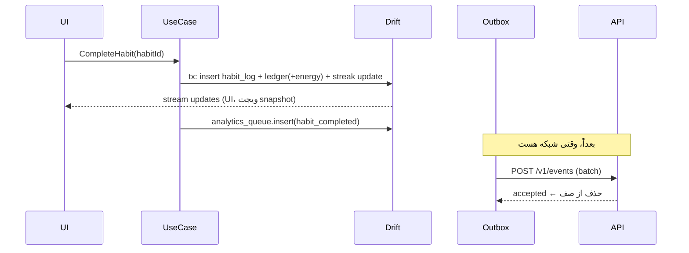

# ۳۰ — مدل داده مشترک، Offline-first، Backup و مهاجرت

## ۱. اصل
داده‌ی کاربر روی دستگاه زندگی می‌کند. سرور فقط سه نوع داده دارد: **هویت/entitlement** (سرور منبع حقیقت)، **config/content** (سرور منبع، کلاینت cache)، **backup رمزشده** (کلاینت منبع، سرور فقط نگهدارنده‌ی blob ناخوانا).

| داده | منبع حقیقت | جهت |
|---|---|---|
| عادت، لاگ عادت، چک‌این، یادداشت، تمرین، کیف پول، ماجراجویی، inventory، streak، تنظیمات | دستگاه | فقط محلی (+ backup E2E فاز۲) |
| entitlement، تریال، خرید | سرور | سرور ← دستگاه (cache امضاشده) |
| config، content | سرور (+ bundled) | سرور ← دستگاه |
| رویدادهای آنالیتیکس | دستگاه تا ارسال | دستگاه ← سرور (یک‌طرفه) |

## ۲. قواعد عمومی جداول محلی
- PK: `id TEXT` UUIDv7 تولید روی دستگاه.
- زمان‌ها: `INTEGER` epoch ms UTC. روز: `local_day TEXT` `YYYY-MM-DD` (گرگوری، محاسبه با `day_start_hour` و timezone دستگاه).
- چت پشتیبانی (D-2): جداول `support_*` فقط روی سرور؛ کلاینت یک کش محلی دارد (drift schema v2، جدول پیام‌های پشتیبانی) و صف outbox برای ارسال idempotent با `client_msg_id`.
- حذف نرم برای داده‌ی کاربر: `deleted_at` (برای backup و undo).
- هر جدول کاربر: `created_at`, `updated_at`.
- `schema_version` در `PRAGMA user_version` (drift).

## ۳. جداول محلی (Drift)
| جدول | فیلدها | نکته |
|---|---|---|
| `app_meta` | `key` PK, `value` | `install_id`, `onboarding_completed`, `cat_name`, `first_open_at`, `last_seen_wall_ms`, `config_version`, `content_versions` JSON |
| `user_settings` | `key` PK, `value` | `day_start_hour`, `notif_*`, `quiet_start`, `quiet_end`, `theme`, `analytics_opt_out` |
| `habits` | `id`, `template_key` (nullable؛ از content، مثلاً `water`)، `title` (برای سفارشی)، `icon`, `schedule_type` (`daily`/`weekly`)، `weekdays_mask` (بیت ۰=شنبه … ۶=جمعه)، `target_per_day` (پیش‌فرض ۱)، `reminder_minutes` (nullable، دقیقه از نیمه‌شب)، `is_custom`, `is_locked` (bool، پیش‌فرض false؛ بعد از انقضای اشتراک برای عادت‌های بیش از سقف، سند ۶۰ §۷), `archived_at`, `sort_order`, `created_at`, `updated_at`, `deleted_at` | «فعال» = `archived_at IS NULL AND deleted_at IS NULL`؛ «قابل تیک» = فعال و `is_locked = false` |
| `habit_logs` | `id`, `habit_id` FK, `local_day`, `count`, `completed_at`, `source` (`app`/`widget`/`notification`) | unique(`habit_id`,`local_day`) |
| `checkins` | `id`, `local_day`, `mood_level` (1..5), `note` (nullable، متن)، `tags` JSON (اختیاری)، `source` (`app`/`widget`/`notification`)، `created_at` | چند چک‌این در روز مجاز؛ پاداش فقط اولی |
| `exercise_sessions` | `id`, `exercise_key`, `started_at`, `completed_at` (nullable)، `duration_s`, `local_day`, `journal_text` (nullable، برای شکرگزاری/یادداشت) | |
| `wallet` | `id`=1, `energy`, `coins`, `updated_at` | مقدار cache؛ حقیقت = جمع ledger |
| `wallet_ledger` | `id`, `currency` (`energy`/`coins`)، `delta`, `reason` (`habit_done`, `checkin`, `exercise_done`, `adventure_start`, `adventure_reward`, `shop_purchase`, `iap_coins`, `promo`, `adjust`), `ref_id` (id موجودیت مرتبط)، `created_at` | unique(`reason`,`ref_id`) ← idempotency |
| `adventures` | `id`, `location_key`, `energy_cost`, `started_at`, `ends_at`, `status` (`active`/`returned`/`claimed`), `reward_coins`, `reward_item_key` (nullable)، `story_key`, `claimed_at` | حداکثر یک `active` |
| `inventory` | `item_key` PK, `acquired_at`, `source` (`shop`/`adventure`/`iap`/`seasonal`), `equipped` (bool), `slot` (`collar`/`hat`/`background`/`room_*`) | |
| `streak_state` | `id`=1, `current`, `longest`, `last_active_day`, `freezes_left`, `freeze_month` (`YYYY-MM` شمسی) | |
| `safety_flags` | `id`, `local_day`, `kind` (`low_mood_streak`/`keyword`)، `shown_at`, `dismissed_at` | فقط محلی؛ هرگز ارسال نمی‌شود |
| `notification_log` | `id`, `type`, `scheduled_for`, `delivered_at` (اگر قابل‌تشخیص)، `opened_at` | برای کاهش فرکانس |
| `entitlement_cache` | `id`=1, `state_json`, `signature`, `kid`, `fetched_at`, `pending_verification_until` | |
| `outbox` | `id`, `kind` (`trial_start`/`purchase_verify`/`purchase_restore`/`events_flush`), `payload` JSON, `attempts`, `next_attempt_at`, `last_error`, `created_at` | |
| `analytics_queue` | `id` (= event_id), `name`, `props` JSON, `ts`, `session_id` | حداکثر ۵۰۰۰ ردیف؛ قدیمی‌ها حذف |
| `content_cache` | `pack_key` PK, `version`, `sha256`, `payload` | |

## ۴. اقتصاد بازی (قواعد قطعی، اعداد از config)
| رویداد | پاداش | کلید config | پیش‌فرض |
|---|---|---|---|
| تکمیل عادت (اولین بار در روز برای آن عادت) | انرژی | `economy.energy_per_habit` | 10 |
| اولین چک‌این روز | انرژی | `economy.energy_per_checkin` | 5 |
| تکمیل تمرین (حداکثر ۳ پاداش/روز) | انرژی | `economy.energy_per_exercise`, `economy.exercise_rewards_per_day` | 10، 3 |
| شروع ماجراجویی | −انرژی | `adventure.locations[].energy_cost` | 20 |
| مدت ماجراجویی | — | `adventure.locations[].duration_minutes` | 30–240 |
| پاداش ماجراجویی | سکه + احتمال آیتم | `adventure.locations[].coins_min/max`, `item_drop_rate` | 15–40، 0.15 |
| سقف انرژی | — | `economy.energy_cap` | 100 |

- برگرداندن تیک عادت (undo در همان روز) ← ledger معکوس با `reason=adjust` فقط اگر انرژی کافی باشد؛ وگرنه فقط لاگ حذف می‌شود و انرژی می‌ماند (بدون تنبیه).
- **تصادف قطعی**: پاداش ماجراجویی هنگام **شروع** با seed = hash(`adventure.id`) محاسبه و ذخیره می‌شود (ضد reroll با kill کردن اپ).
- **ضد دست‌کاری ساعت (ملایم)**: `last_seen_wall_ms` نگه داشته می‌شود؛ اگر ساعت دستگاه > ۱۰ دقیقه به عقب رفت، ماجراجویی فعال بر اساس `ends_at` اصلی می‌ماند. جلو بردن ساعت پذیرفته می‌شود (هزینه‌ی ضدتقلب سخت > سود در اپ آفلاین غیررقابتی). در صورت دسترسی، `server_time` از پاسخ entitlement برای ثبت drift استفاده می‌شود.

## ۵. Streak
- روز «فعال» = حداقل یکی از: تکمیل یک عادت، یک چک‌این، یک تمرین کامل.
- در شروع هر روز (یا باز شدن اپ): اگر `last_active_day` = دیروز ← ادامه. اگر فاصله = ۲ روز و `freezes_left > 0` ← مصرف خودکار freeze، streak ادامه. وگرنه ← `current = 0` **بدون پیام منفی**؛ متن «از نو شروع می‌کنیم» از content.
- `freezes_left` در شروع هر ماه شمسی به `streak.freezes_per_month` (پیش‌فرض ۱) ریست می‌شود.

## ۶. CatMoodResolver (domain، خالص)
ترتیب اولویت (اولین شرط برقرار):
1. ماجراجویی فعال ← گربه «بیرون» است (activity=`away`، تصویر جای خالی + یادداشت).
2. ساعت محلی ۲۳ تا ۶ ← `sleepy`.
3. آخرین چک‌این امروز `mood_level ≤ 2` ← `sad` (همدلی، متن آرام؛ **نه** به خاطر غیبت کاربر).
4. همه عادت‌های امروز انجام شده یا ماجراجویی تازه claim شده ← `proud`.
5. پیش‌فرض ← `happy`. (فاز ۲: `curious` هنگام فروشگاه، `tea` در تمرین چای عصرگاهی.)

## ۷. تشخیص ناراحتی (DistressDetector، فقط محلی)
- `low_mood_streak`: `mood_level = 1` در ۳ چک‌این از ۴ روز اخیر.
- `keyword`: تطبیق یادداشت با فهرست کلیدواژه (از content pack `safety`، نرمال‌سازی ی/ک و نیم‌فاصله).
- نتیجه: نمایش کارت مهربان «اگه دوست داری با یکی حرف بزنی…» با لینک به `/safety`؛ حداکثر یک بار در ۴۸ ساعت؛ هیچ قفل یا پی‌والی در این مسیر.

## ۸. Offline-first: جریان‌ها

- هیچ use case کاربرمحوری منتظر شبکه نمی‌ماند، به‌جز: خرید (SDK مارکت)، restore، و (فاز۲) backup/OTP.

## ۹. حل تعارض
- داده‌ی کاربر تک‌منبع (یک دستگاه) ← تعارض رکوردی وجود ندارد.
- Entitlement: سرور همیشه برنده؛ اگر `pending_verification` محلی وجود دارد و سرور می‌گوید `PURCHASE_INVALID` ← موقت حذف، پیام مهربان با «تماس با ما».
- Backup restore (فاز ۲): **جایگزینی کامل** داده‌ی محلی با snapshot بعد از تأیید صریح کاربر (نمایش تاریخ backup و خلاصه). ادغام انجام نمی‌شود (سادگی، پیش‌بینی‌پذیری).
- Config/content: نسخه بالاتر برنده؛ اگر `min_app_version` > نسخه اپ ← نادیده.

## ۱۰. Backup / Restore (فاز ۲، E2E)
```mermaid
flowchart LR
  A[فعال‌سازی backup] --> B[تولید recovery code ۲۴ نویسه\nنمایش + تأیید کاربر]
  B --> C[key = Argon2id(code, salt)\nپارامترها در kdf_params]
  C --> D[snapshot: export JSON همه جداول کاربر\n(بدون outbox/analytics/cache)]
  D --> E[gzip → AES-256-GCM]
  E --> F[PUT /v1/backup]
```
- خودکار: روزانه با WorkManager اگر شبکه unmetered یا اندازه < 1MB؛ دستی از تنظیمات.
- Restore روی دستگاه جدید: ورود (اتصال شماره با OTP یا همان `user_id` با recovery code) ← `GET /v1/backup` ← رمزگشایی با recovery code ← import در تراکنش ← `schema_version` قدیمی‌تر با migration snapshot (هر نسخه یک تابع upgrade JSON).
- گم شدن recovery code = backup غیرقابل‌بازیابی (به کاربر صریح گفته می‌شود). دلیل: سرور هرگز قادر به خواندن یادداشت‌ها نیست.

## ۱۱. مهاجرت داده
| لایه | روش |
|---|---|
| Drift | `schemaVersion` + `MigrationStrategy.onUpgrade` با `stepByStep`؛ اسکیمای هر نسخه با `drift_dev schema dump` در `drift_schemas/` ذخیره و در CI با `SchemaVerifier` تست می‌شود. هرگز مهاجرت مخرب بدون export. |
| Postgres | `goose` SQL up/down؛ تغییرات expand→migrate→contract (سازگار با نسخه قبلی API در حین deploy). |
| Config | `config.schema.json` نسخه‌دار؛ کلید جدید همیشه با پیش‌فرض bundled؛ کلید حذف‌شده یک نسخه deprecated می‌ماند. |
| Content | `pack_schema_version` در هر pack؛ کلاینت pack با schema ناشناخته را نادیده می‌گیرد. |
| Backup snapshot | `schema_version` + زنجیره upgrade. |

## ۱۲. نگاشت انواع کلاینت↔سرور
| مفهوم | کلاینت | سرور/API |
|---|---|---|
| ID | `String` UUIDv7 | `uuid` |
| زمان | `DateTime` UTC (ذخیره epoch ms) | RFC3339 UTC |
| روز | `LocalDay` | — (API هیچ فیلد `local_day` رد و بدل نمی‌کند؛ روز فقط مفهوم محلی است) |
| market | `enum Market {bazaar, myket}` | `"bazaar"`/`"myket"` |
| entitlement | `"premium"` | `"premium"` |

## تغییرات پرامپت 22
- مهاجرت drift v3: `habits` + `area_key, time_of_day, repeat_type (daily|weekly|once), due_day, goal_key` (داده‌ی `template_key` به `goal_key` کپی می‌شود؛ ستون قدیمی می‌ماند)؛ جدول‌های جدید `onboarding_answers(key,value)`، `discoveries_found(discovery_key, found_at)`، `quest_progress(quest_key, progress, claimed_at)`، `quest_daily_state(local_day, quest_keys JSON, claimed JSON)`، `shop_rotation(local_day, refresh_count, item_keys JSON)`.
- `user_settings`: `pause_mode`, `paused_since`. `app_meta`: `user_name`, `cat_stage`, `cat_fur`, `cat_trait`.
- ledger reasonهای جدید: `quest_reward`, `shop_refresh`, `item_sell`.
- اقتصاد: `economy.energy_per_goal` (5) جایگزین `energy_per_habit`؛ `adventure.daily_energy_target` (20): با پرشدن نوار، ماجراجویی روز خودکار شروع می‌شود (حداکثر یکی در روز؛ انرژی اضافه تا `economy.energy_cap` ذخیره می‌شود).
- رشد: `growth.thresholds` (young=7، adult=30 ماجراجویی). حالت استراحت: streak فریز (بدون مصرف freeze)، فقط نوتیف `trial`، بدون مأموریت روزانه.
