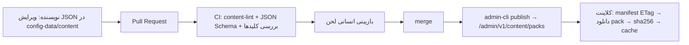

# ۴۰ — سیستم محتوا و متن (Copy)

## ۱. هدف
همه متن‌های کاربرمحور، تمرین‌ها، ماجراجویی‌ها، آیتم‌های فروشگاه و شماره‌های کمک **داده** هستند، نه کد. تغییرشان بدون انتشار نسخه جدید ممکن است (content pack از سرور)، و اپ از اولین اجرا آفلاین کار می‌کند (pack bundled).

## ۲. Packها
| `pack_key` | محتوا | به‌روزرسانی از راه دور |
|---|---|---|
| `brand` | `app_name`, `cat_default_name`, `support_contact` (`in_app_chat`، D-2) | بله |
| `copy_fa` | همه رشته‌های UI و نوتیف با کلید | بله |
| `habit_templates` | عادت‌های پایه (`water`, `sleep`, `short_break`, `walk`, `healthy_food`, `medicine`, `loved_ones`) | بله |
| `exercises` | تمرین‌ها: گام‌ها، زمان‌بندی، متن | بله |
| `adventures` | مکان‌ها و داستان‌های کوتاه | بله (اعداد اقتصادی در config) |
| `shop_items` | آیتم‌ها: `item_key`, نام، slot، قیمت سکه، `premium_only`, asset | بله (asset جدید فقط اگر در APK باشد یا از CDN کش شود — فاز۲) |
| `safety` | متن صفحه کمک، خطوط کمک، کلیدواژه‌های تشخیص | بله |
| `seasonal_{key}` (فاز۲) | `nowruz`, `yalda`, `ramadan` با بازه تاریخ شمسی | بله |

### قالب `seasonal_{key}` (فاز ۲)
`entries` یک آبجکت است: `seasonal_key`؛ `from`/`to` (تاریخ **شمسی** `YYYY-MM-DD`، شامل دو سر؛ سال صریح است چون رمضان بین سال‌ها جابه‌جا می‌شود و هر سال pack دوباره منتشر می‌شود)؛ `strings` (`name`، `home_banner`، اختیاری `notif_body`؛ متن مستقیم در pack)؛ `theme.accent` (اختیاری)؛ `items[]` (مثل `shop_items` ولی با `name` مستقیم به‌جای `name_key`). کلاینت pack را فقط داخل بازه نشان می‌دهد؛ آیتم‌های خریده‌شده بعد از پایان فصل در کمد می‌مانند. رمضان فقط متن و تم دارد (بدون آیتم و بدون gamification).

قالب عمومی هر pack:
| فیلد | توضیح |
|---|---|
| `pack_key` | |
| `version` | int |
| `pack_schema_version` | int |
| `locale` | `fa` |
| `min_app_version` | |
| `entries` | آبجکت/آرایه مخصوص pack |

## ۳. ساختار `copy_fa`
- کلید: `{feature}.{screen_or_context}.{element}[.{variant}]`، snake_case. مثال: `home.greeting.morning.1`، `notif.habit_reminder.water.2`، `paywall.trial_ending.title`.
- مقدار: رشته یا آرایه‌ی **variant**ها (انتخاب تصادفی قطعی per روز: `hash(key + local_day) % n`) ← تنوع بدون تکرار آزاردهنده.
- جمع: کلید `.one` / `.other` (فارسی معمولاً یکی؛ برای ارقام از `{n}` استفاده شود).

### متغیرها
| متغیر | منبع |
|---|---|
| `{APP_NAME}` | `brand.app_name` |
| `{CAT_NAME}` | نامی که کاربر انتخاب کرده؛ fallback `brand.cat_default_name` |
| `{n}` | عدد (به ارقام فارسی تبدیل می‌شود) |
| `{habit}` | عنوان عادت |
| `{place}` | نام مکان ماجراجویی |
| `{item}` | نام آیتم (فروشگاه/هدیه) |
| `{date}` | تاریخ شمسی |
| `{time}` | ساعت (`۸:۳۰`) |

`CopyResolver.t(key, vars)`: (۱) pack دانلودی معتبر ← (۲) bundled ← (۳) خود کلید در debug / رشته خالی‌امن در release + لاگ. متغیر ناشناخته ← خطای lint در CI.

### نمونه ساختار (نه محتوای نهایی)
| کلید | مقدار نمونه |
|---|---|
| `home.greeting.morning` | `["صبح بخیر! {CAT_NAME} تازه بیدار شده.", "سلام صبح‌بخیر، چایی آماده‌ست؟"]` |
| `checkin.prompt` | `"امروز چه حالی داری؟"` |
| `checkin.mood.1` … `.5` | برچسب پنج حالت |
| `streak.reset` | `"از نو شروع می‌کنیم، {CAT_NAME} همین‌جاست."` |
| `adventure.away` | `"{CAT_NAME} رفته {place}. زود برمی‌گرده."` |

## ۴. قوانین لحن (Style Guide)
| قانون | انجام بده | نکن |
|---|---|---|
| محاوره‌ای گرم | «یه لیوان آب بد نیست، نه؟» | «لطفاً آب بنوشید.» |
| بدون سرزنش | «هر وقت آماده‌ای همین‌جاییم.» | «دیروز فراموش کردی!» |
| بدون گناه | «اگه یه دقیقه وقت داری…» | «گربه‌ات ناراحته چون نیومدی.» |
| بدون واژه پزشکی | «آروم شدن»، «استراحت» | درمان، تشخیص، اختلال، افسردگی، اضطراب (به‌عنوان برچسب)، بیمار |
| کوتاه | نوتیف ≤ ۸۰ نویسه، عنوان ≤ ۲۵ | پاراگراف |
| شخصیت گربه | آرام، شیطون، مهربان | طعنه، تحقیر |
| دوز ایرانی | چای، پشت‌بام، حیاط، بازار | فولکلور سنگین، شعار |
| نیم‌فاصله و ی/ک فارسی | «می‌شه»، «خونه‌ست» | «میشه» با فاصله غلط، ي/ك عربی |
| بدون فشار فروش | «هر چی خواستی، بدون فشار.» | «فقط امروز!»، شمارش معکوس جعلی |

**Lint خودکار (CI روی packها):** واژه‌های ممنوع (فهرست در `content-lint/banned_words.txt`)، طول، متغیرهای مجاز، ی/ک عربی، وجود همه کلیدهای bundled در pack دانلودی.

## ۵. تمرین‌ها (`exercises`)
| فیلد | توضیح |
|---|---|
| `key` | `breathing_basic`, `gratitude`, `guided_journal`, `muscle_relax`, `afternoon_tea` |
| `premium` | bool (منبع نهایی: `limits.free_exercises` در config) |
| `duration_s` | ۶۰–۳۰۰ |
| `type` | `timer_steps` / `journal_prompt` |
| `steps` | `[{text_key, seconds, animation: inhale|hold|exhale|none}]` |
| `prompts` | برای journal: فهرست کلید سؤال |
| `collection` | `stress`/`sleep`/`focus` (فاز۲) |
| `disclaimer_key` | متن «این تمرین جایگزین کمک تخصصی نیست» |

## ۶. ماجراجویی (`adventures`)
| فیلد | توضیح |
|---|---|
| `location_key` | `alley`, `rooftop`, `courtyard` (MVP)؛ `bazaar`, `garden` (پریمیوم/فاز۲) |
| `name_key`, `bg_asset` | |
| `stories` | `[{story_key, text_key, weight}]` متن ۱–۲ جمله‌ای بازگشت |
| `possible_items` | `[item_key]` |
| اعداد (هزینه، مدت، پاداش) | **در config** (`adventure.locations`)، نه content |

## ۷. صفحه ایمنی (`safety`)
- `hotlines: [{label_key, number, hours_key, verified_at}]` — شماره‌ها **[نیاز به راستی‌آزمایی]** (V9)؛ اگر `verified_at` خالی است، اپ فقط متن عمومی «با یه نفر مورد اعتماد یا متخصص حرف بزن» را نشان می‌دهد.
- `keywords`: فهرست الگوهای تشخیص (فقط محلی).
- `not_medical_disclaimer_key`.

## ۸. چرخه انتشار محتوا

- Rollback: انتشار نسخه بالاتر با محتوای قبلی (packها immutable).
- اپ هر نسخه، packهای فعلی را bundled دارد (اسکریپت build از `config-data/content` کپی می‌کند).

## ۹. آماده‌سازی تغییر نام
`brand` pack + `{APP_NAME}`/`{CAT_NAME}` در همه متن‌ها. نام بسته Android (`applicationId`) و نام نمایشی launcher از `android/` per flavor با `resValue` از یک فایل `brand.properties` ← تغییر نام = تغییر یک فایل + pack.

## packهای پرامپت 22
| pack | محتوا |
|---|---|
| `goal_library` | ≥۸۰ هدف اورجینال: `key, title_key, icon, area_key, tabs[], difficulty 1..3, minutes, default_time_of_day, default_repeat (daily|once|weekdays:0,2), need_tags[]` (`low_<area>`/`mid_<area>`) |
| `quests_daily` | استخر مأموریت روزانه: `key, title_key, metric, target, route, fixed?` |
| `quests_special` | `key, title_key, hint_key, metric, target, reward_coins, route` |
| `discoveries` | `key, name_key, category (food|plant|antique|sound|sky)` |
| `reflection_prompts` | پرسش دوگزینه‌ای محلی: `prompt_key, a_key, b_key` |
`habit_templates` فقط برای نگاشت داده‌ی قدیمی می‌ماند. `shop_items` اسلات‌های `glasses, scarf, room_shelf` و فیلد `always_available` (کلکسیون همیشگی)؛ `exercises` فیلد `tab` و `reward_energy` و ۸ تمرین تنفس. فیلدهای اختیاری `kind` (`reflection|breathing|grounding|movement|timer`) و `icon` (شناسه‌ی استیکر، مثل `calm/zzz`) و ۲۳ تمرین اورجینال نوشتنی، زمین‌گیری، کششی و تایمر (جمعاً ۳۵).
