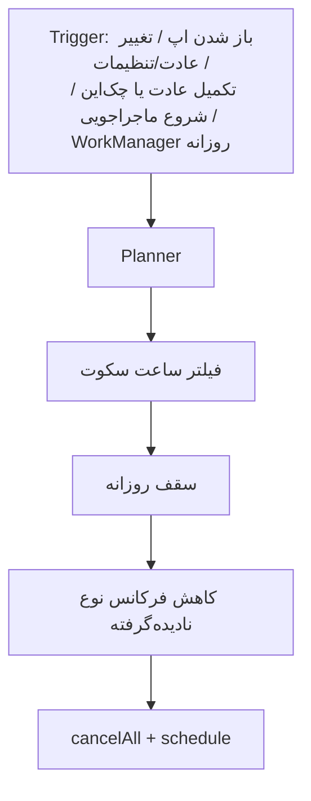

# ۵۰ — نوتیفیکیشن‌ها

## ۱. اصول
کم، گرم، قابل‌کنترل، هرگز گناه‌انگیز، بدون اطلاعات حساس (حال ثبت‌شده، متن یادداشت) در متن نوتیف. **کانال اصلی: نوتیف محلی زمان‌بندی‌شده.** پوش سرور نداریم (D-9): پاسخ پشتیبانی با WebSocket (اپ باز) + polling پس‌زمینه (WorkManager `support_poll`) + نوتیف محلی نوع `support_reply` (بدون متن پیام). انتخاب سرویس پوش آینده: V7.

## ۲. انواع
| `type` | زمان | شرط | کانال Android | پیش‌فرض |
|---|---|---|---|---|
| `morning` | `notif.morning_time` (پیش‌فرض ۰۹:۰۰) | — | `daily` | روشن |
| `habit_reminder` | `habits.reminder_minutes` هر عادت | عادت امروز برنامه دارد و هنوز انجام نشده | `reminders` | روشن اگر کاربر زمان گذاشته |
| `evening_checkin` | `notif.evening_time` (۲۰:۳۰) | امروز چک‌این نشده | `daily` | روشن |
| `cat_returned` | `adventures.ends_at` | ماجراجویی فعال | `cat` | روشن |
| `streak_gentle` | ۱۹:۰۰ | streak ≥ ۳، امروز فعال نبوده، و `streak_gentle` در ۲ روز گذشته ارسال نشده | `daily` | **خاموش** (opt-in در تنظیمات) — دلیل: کمترین ریسک گناه‌انگیزی |
| `comeback` | ۳، ۷، ۱۴ روز بعد از آخرین باز شدن، ۱۸:۰۰ | — | `daily` | روشن |
| `trial` | روز ۶ و ۷ تریال، ۱۲:۰۰ | تریال فعال و اشتراک نخریده | `account` | روشن (شفافیت الزامی) |
| `seasonal` | تاریخ مناسبت (از content) | pack فصلی فعال | `daily` | روشن |

## ۳. NotificationPlanner (domain، تابع خالص)
ورودی: `now`, تنظیمات کاربر، `AppConfig.notifications`, عادت‌ها و لاگ امروز، ماجراجویی فعال، streak، وضعیت تریال، `notification_log`.
خروجی: فهرست `PlannedNotification{id, type, fire_at, title_key, body_key, vars, payload_route}` برای **۷ روز آینده**.

قواعد:
1. **ساعت سکوت**: `quiet_start`–`quiet_end` (پیش‌فرض ۲۲:۳۰–۰۸:۰۰). نوتیف داخل بازه ← به پایان بازه منتقل، مگر `cat_returned` که حذف و در باز شدن بعدی اپ نشان داده می‌شود.
2. **سقف روزانه**: `notifications.max_per_day` (پیش‌فرض ۳). اولویت: `trial` > `habit_reminder` > `cat_returned` > `evening_checkin` > `morning` > `seasonal` > `comeback` > `streak_gentle`.
3. **کاهش فرکانس** (A14): اگر ۳ نوتیف پیاپی از یک `type` باز نشد ← آن نوع یک روز در میان؛ ۳ بار دیگر ← هفتگی؛ با باز شدن یکی، به حالت عادی برمی‌گردد. (`habit_reminder` per عادت حساب می‌شود.)
4. وقتی کار انجام شد (عادت تیک خورد، چک‌این ثبت شد) ← re-plan؛ نوتیف مرتبط امروز لغو.
5. **عدم تکرار متن**: variant با `hash(key + local_day)`.
6. شناسه نوتیف قطعی: `hash(type + ref + fire_day)` ← reschedule بدون تکراری.

## ۴. اجرای فنی در Android
| موضوع | تصمیم |
|---|---|
| زمان‌بندی | `zonedSchedule` با `AndroidScheduleMode.inexactAllowWhileIdle` (پیش‌فرض)؛ exact فقط برای `habit_reminder` اگر کاربر مجوز «آلارم دقیق» بدهد |
| مجوز Android 13+ | `POST_NOTIFICATIONS` در مرحله ۴ آنبوردینگ با توضیح قبلی (pre-prompt)؛ رد ← اپ بی‌مشکل، بنر ملایم در تنظیمات |
| آلارم دقیق | `SCHEDULE_EXACT_ALARM` فقط opt-in؛ **عدم استفاده از `USE_EXACT_ALARM`** (سیاست مارکت‌ها **[نیاز به راستی‌آزمایی]** V10) |
| ریبوت | receiverهای `flutter_local_notifications` (`RECEIVE_BOOT_COMPLETED`) + re-plan در اولین باز شدن |
| ماندگاری | WorkManager روزانه `notif_replan` (constraint: none، flex ۶ ساعت) برای پر کردن پنجره ۷ روزه |
| محدودیت سازندگان (Xiaomi، Huawei، Samsung) | صفحه «نوتیف‌ها نمیان؟» در تنظیمات با راهنمای غیرفعال‌سازی بهینه‌سازی باتری per سازنده (متن از content)؛ درخواست `REQUEST_IGNORE_BATTERY_OPTIMIZATIONS` **انجام نمی‌شود** (سیاست مارکت و تجربه) |
| کانال‌ها | `daily`, `reminders`, `cat`, `account` — کاربر از تنظیمات سیستم هم کنترل دارد |
| tap | payload = route (`/checkin`, `/habits/{id}`, `/adventure/result/{id}`, `/paywall?trigger=trial_ending`) ← go_router |
| اکشن سریع | `habit_reminder`: دکمه «انجام شد» (background isolate ← `CompleteHabit`, `source=notification`) |
| timezone | `timezone` package با zone دستگاه؛ تغییر zone ← re-plan |

## ۵. تشخیص «باز نشدن»
- `opened_at` هنگام tap ثبت می‌شود. «تحویل» در Android بدون سرویس قابل‌اتکا نیست ← نوتیفی که `fire_at` گذشته و `opened_at` ندارد و اپ هم ظرف ۲ ساعت باز نشده = نادیده‌گرفته.

## ۶. متن‌ها
در `copy_fa` با کلید `notif.{type}.title` / `notif.{type}.body` (آرایه variant). الگوها از spec بخش ۹. قوانین: سند ۴۰ §۴، ≤ ۸۰ نویسه، بدون واژه پزشکی، بدون حال ثبت‌شده.

## ۷. کلیدهای config
| کلید | پیش‌فرض |
|---|---|
| `notifications.max_per_day` | 3 |
| `notifications.default_morning_time` | `"09:00"` |
| `notifications.default_evening_time` | `"20:30"` |
| `notifications.default_quiet` | `{"start":"22:30","end":"08:00"}` |
| `notifications.comeback_days` | `[3,7,14]` |
| `notifications.ignore_threshold` | 3 |
| `notifications.types_enabled` | `{type: bool}` (kill switch از راه دور) |

## ۸. نبود FCM — جمع‌بندی
- هیچ قابلیت حیاتی به پوش وابسته نیست. محتوای زمان‌حساس (تخفیف، مناسبت) از طریق config هنگام باز شدن اپ + نوتیف محلی `seasonal` زمان‌بندی‌شده از content.
- فاز ۳: `PushProvider` interface (Pushe/Najva/…) فقط برای پیام‌های اعلانی غیرحیاتی، با opt-in.
