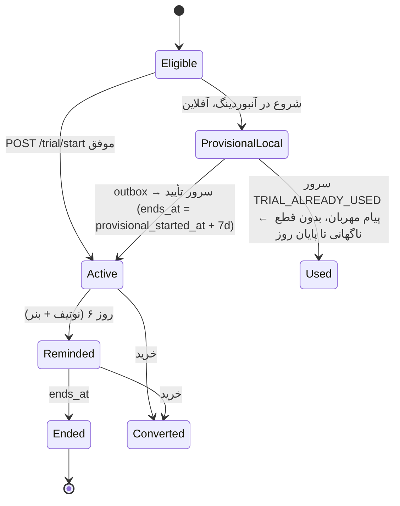
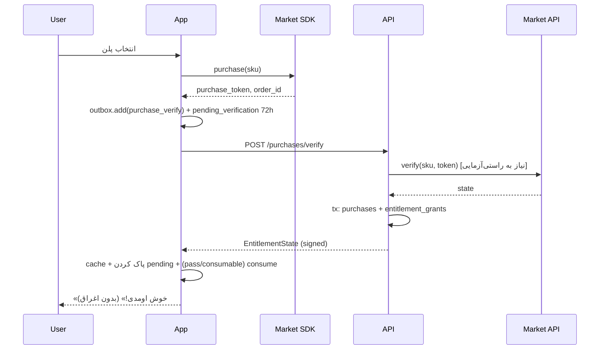

# ۶۰ — درآمد و Entitlement

## ۱. مدل
اشتراک‌محور، **بدون تبلیغ**. یک entitlement: `premium`. خرید مکمل: بسته سکه/آیتم ظاهری.

## ۲. محصولات (`products`، نگاشت به SKU مارکت از config)
| `product_id` | نوع | `duration_days` | نقش |
|---|---|---|---|
| `premium_1m` | subscription یا pass | 30 | **لنگر قیمتی** (گران‌تر per ماه) |
| `premium_3m` | subscription یا pass | 90 | |
| `premium_6m` | subscription یا pass | 180 | |
| `premium_12m` | subscription یا pass | 365 | پیش‌فرض انتخاب‌شده در پی‌وال |
| `coins_small`, `coins_medium` | consumable | — | سکه |
| `item_pack_{key}` | non-consumable | — | آیتم ظاهری (اختیاری فاز۲) |

- اگر مارکت اشتراک خودکار را پشتیبانی کند ← `subscription` (تمدید با re-verify). اگر نه ← `pass` (consumable؛ بعد از verify، consume می‌شود و grant دوره‌دار صادر؛ تمدید = خرید دوباره با یادآوری). **[نیاز به راستی‌آزمایی]** V2، V3.
- grant دوره‌ی `pass` روی grant فعلی **انباشته** می‌شود (`starts_at = max(now, current_end)`).

## ۳. کلیدهای config
| کلید | مثال | توضیح |
|---|---|---|
| `limits.free_active_habits` | 3 | |
| `limits.free_custom_habits` | 0 | عادت سفارشی پریمیوم |
| `limits.free_exercises` | `["breathing_basic"]` | |
| `limits.free_adventure_locations` | `["alley","rooftop","courtyard"]` | |
| `pricing.plans` | `[{product_id, market_sku: {bazaar, myket}, display_price_toman, badge_key, highlight}]` | ترتیب = ترتیب نمایش |
| `pricing.monthly_anchor_product` | `premium_1m` | برای محاسبه «٪ صرفه‌جویی» |
| `trial.enabled` | true | |
| `trial.days` | 7 | |
| `trial.reminder_day` | 6 | |
| `paywall.variant` | `"a"` | چیدمان (از experiment) |
| `paywall.triggers` | `{fourth_habit: true, custom_habit: true, premium_exercise: true, premium_location: true, premium_item: true, stats_deep: true, trial_end: true, settings: true}` | |
| `paywall.cooldown_hours` | 24 | پی‌وال خودکار (غیر از اقدام مستقیم کاربر) حداکثر یک بار در این بازه |
| `entitlement.grace_days` | 3 | |
| `entitlement.offline_validity_days` | 7 | |
| `entitlement.pending_verification_hours` | 72 | |

## ۴. تریال

- شروع: مرحله آخر آنبوردینگ با دکمه «شروع ۷ روز رایگان» (صریح؛ بدون نیاز به پرداخت).
- `device_hash` unique در `trials` ← یک تریال per دستگاه (V12). کاربری که تریال نگرفته، بعداً از تنظیمات/پی‌وال هم می‌تواند شروع کند.
- `provisional_started_at` فقط اگر ≤ ۴۸ ساعت قبل از `server_time` باشد پذیرفته می‌شود؛ وگرنه `now`.
- روز ۶: نوتیف `trial` + بنر خانه «فردا دوره رایگان تموم می‌شه» + لینک پی‌وال. پایان: یک صفحه آرام «حالا چی؟» (نه پاپ‌آپ تهاجمی) با مقایسه رایگان/پریمیوم.

## ۵. پی‌وال
- **مجاز**: تلاش برای عادت فعال چهارم، ساخت عادت سفارشی، باز کردن تمرین/مکان/آیتم پریمیوم، آمار عمیق، پایان تریال، از تنظیمات.
- **ممنوع**: حین تمرین، صفحه کمک، بلافاصله بعد از چک‌این با `mood_level ≤ 2`، اولین جلسه قبل از اتمام آنبوردینگ (غیر از پیشنهاد تریال).
- محتوا: مزایا (از copy)، پلن‌ها از `pricing.plans` (قیمت واقعی از `PaymentGateway.products` اگر برگشت، وگرنه `display_price_toman`)، «٪ صرفه‌جویی نسبت به ماهانه»، دکمه «بازگردانی خرید»، لینک شرایط و حریم خصوصی، دکمه بستن واضح.
- بدون شمارش معکوس جعلی یا الگوی تاریک.

## ۶. منطق Entitlement (کلاینت)
```
isPremium(now):
  s = entitlement_cache (verified signature با kid معتبر)
  if s == null: return pendingVerificationActive(now)
  if any e in s.entitlements: e.starts_at <= now < e.ends_at  → true
  if now < s.valid_until and آخرین ends_at + grace_days > now → true   # آفلاین/خطای مارکت
  return pendingVerificationActive(now)
```
- `now` = ساعت دستگاه اصلاح‌شده با `server_time - fetched_at` drift (اگر موجود).
- رفرش: باز شدن اپ (حداکثر هر ۶ ساعت)، بعد از خرید/restore، و نزدیک `ends_at`.
- امضا نامعتبر ← نادیده (مثل نبود cache).

### جریان خرید

- consume برای `pass`/coins **فقط بعد از** پاسخ موفق سرور (تا در صورت crash، توکن برای retry باقی بماند).

## ۷. سناریوهای لبه
| سناریو | رفتار |
|---|---|
| انقضای اشتراک | پایان grant ← بازگشت به رایگان؛ داده‌ها حفظ؛ عادت‌های اضافه **بایگانی نمی‌شوند** بلکه «خواندنی» می‌مانند (تیک فقط روی ۳ عادت اول به ترتیب `sort_order`؛ کاربر می‌تواند انتخاب کند کدام ۳ تا فعال بمانند) |
| آیتم‌های پریمیوم equipped | در کمد باقی می‌مانند و دیده می‌شوند (احساس از دست دادن ایجاد نشود)؛ فقط خرید/equip جدید پریمیوم قفل |
| بازگردانی خرید | `PaymentGateway.restore()` ← `POST /purchases/restore` ← grantها؛ اگر توکن متعلق به user دیگر باشد و همان `device_hash` ← انتقال؛ وگرنه `PURCHASE_ALREADY_CLAIMED` با راهنمای پشتیبانی |
| تغییر گوشی | restore از مارکت با همان حساب مارکت ← اشتراک برمی‌گردد (داده‌ها با backup فاز۲) |
| لغو تمدید خودکار | grant تا پایان دوره فعال؛ re-verify در worker `auto_renewing=false` را ثبت می‌کند |
| رفاند | worker/verify ← `refunded` ← `revoked_at` روی grant؛ کلاینت در رفرش بعدی رایگان می‌شود (بدون پیام سرزنش‌آمیز) |
| خطای مارکت در خرید | پیام «مارکت جواب نداد، پولی کم نشده؛ دوباره امتحان کن» (اگر SDK خطا داد)؛ اگر پرداخت شد ولی verify نشد ← pending + retry outbox |
| آفلاین هنگام پایان اشتراک | `grace_days` با آخرین سند امضاشده؛ بعد از آن رایگان تا اتصال |
| ساعت دستگاه دست‌کاری‌شده | `valid_until` سقف مطلق دارد؛ با drift از `server_time` اصلاح |
| نصب مجدد بدون حساب | کاربر جدید؛ restore اشتراک از مارکت کار می‌کند؛ تریال دوباره نه |
| تعویض flavor (بازار↔مایکت) | اشتراک مارکت دیگر قابل restore نیست؛ کاربر می‌تواند از پشتیبانی promo grant بگیرد (admin) |

## ۸. سمت سرور (خلاصه، جزئیات سند ۱۰ §۸)
- `GET /v1/entitlements`، `POST /v1/trial/start`، `POST /v1/purchases/verify`، `POST /v1/purchases/restore`.
- Worker re-verify هر ۶ ساعت.
- Promo grant از admin با `reason` و audit.

## ۹. خرید درون‌برنامه‌ای مکمل (سکه)
- محصولات `coins_*` ← سرور `coins_granted` برمی‌گرداند ← کلاینت `wallet_ledger(reason=iap_coins, ref_id=purchase_id)`.
- سقف قیمت پایین؛ هیچ آیتم فروشگاهی «فقط با پول واقعی» در MVP (هر آیتم با سکه فعالیت قابل‌دسترسی است، جز `premium_only`).

## فروشگاه چرخشی (پرامپت 22)
موجودی روزانه ۶ آیتم با seed=`hash(install_id+local_day)`؛ تازه‌سازی پولی `shop.refresh_cost`؛ فروش با `shop.sell_ratio`؛ آیتم equipped قابل فروش نیست. آیتم‌های پریمیوم با `PremiumBadge` و همان `PremiumGate` موجود.
