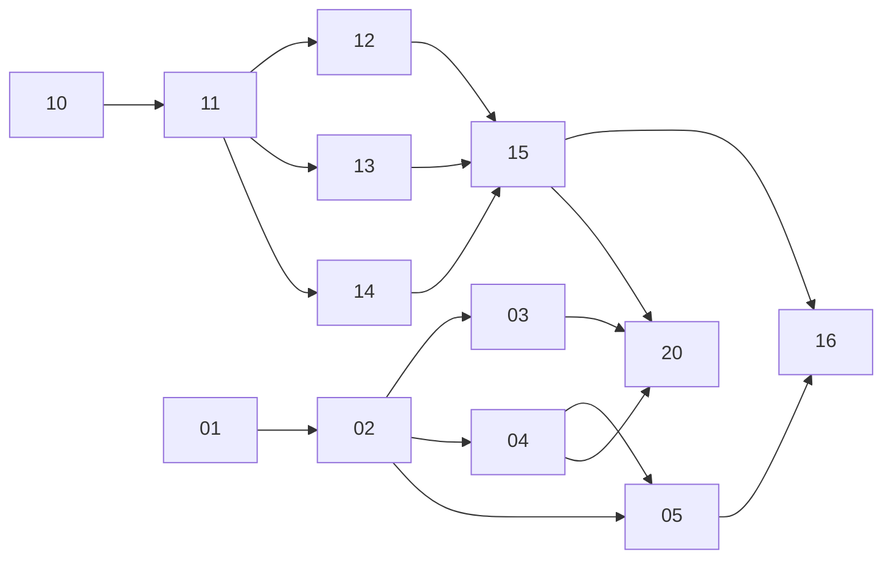

# پرامپت‌ها — فهرست، ترتیب اجرا و قواعد مشترک

> هر پرامپت مستقل است: مدل کدنویس فقط همان فایل + پوشه `docs/` را لازم دارد. **قبل از هر پرامپت، این فایل (۰۰) را هم بخوان.**

## ۱. ترتیب و وابستگی
| # | فایل | فاز | وابسته به | موازی‌پذیر با |
|---|---|---|---|---|
| 01 | `01-backend-foundation.md` | MVP | — | 10 |
| 02 | `02-backend-auth-user.md` | MVP | 01 | 10، 11 |
| 03 | `03-backend-entitlements.md` | MVP | 02 | 11، 12 |
| 04 | `04-backend-config-content-analytics.md` | MVP | 02 | 03 |
| 05 | `05-backend-sync.md` (اتصال شماره + backup) | فاز ۲ | 02، 04 | 16 |
| 10 | `10-frontend-foundation.md` | MVP | — (قرارداد API از docs) | 01 |
| 11 | `11-frontend-core-loop.md` | MVP | 10 | 02–04 |
| 12 | `12-frontend-exercises-shop.md` | MVP | 11 | 13 |
| 13 | `13-frontend-notifications-widgets.md` (بخش A: MVP، بخش B: فاز ۲) | MVP/۲ | 11 | 12 |
| 14 | `14-frontend-monetization.md` | MVP | 11، (سرور: 03) | 12، 13 |
| 15 | `15-frontend-onboarding-polish.md` | MVP | 11–14 | — |
| 16 | `16-frontend-phase2.md` (backup، اتصال شماره، آمار عمیق، فصلی، Rive) | فاز ۲ | 15، 05 | — |
| 21 | `21-decisions-alignment-and-support-chat.md` (تصمیم‌های D-1..D-9 و چت پشتیبانی) | MVP/۲ | 05، 16 | — |
| 20 | `20-integration-and-release.md` | MVP (و تکرار در هر فاز) | همه MVP | — |



**دلیل تغییر نسبت به فهرست پیشنهادی:** (۱) `05` شامل اتصال شماره (OTP) هم شد چون restore روی دستگاه جدید به آن وابسته است و هر دو فاز ۲ هستند؛ (۲) `16` اضافه شد تا کارهای فرانت فاز ۲ از پرامپت‌های MVP جدا بمانند و MVP قابل‌انتشار باشد؛ (۳) `13` دو بخش دارد چون نوتیف MVP است و ویجت فاز ۲.

## ۲. قواعد مشترک همه پرامپت‌ها
### ساختار مخزن
```
backend/   # Go module: {module_path}/backend  (سند ۱۰ §۴)
app/       # Flutter app (سند ۲۰ §۲)
config-data/
  config/          # default + نسخه‌ها، schema/config.schema.json
  content/         # packها (سند ۴۰)
  analytics/events.json   # منبع واحد نام رویدادها و props (سند ۷۰)
docs/  prompts/  input/
```
### منبع حقیقت
- نام‌ها، API، جداول، رویدادها: **فقط** از `docs/`. اگر پرامپت با docs تناقض داشت، docs برنده است و تناقض را در `docs/open-questions.md` ثبت کن.
- واژه‌نامه canonical: `docs/00-overview.md` §۷.
- هیچ رشته کاربرمحور hard-code نشود؛ از `copy_fa` (سند ۴۰). نام‌ها: `{APP_NAME}`، `{CAT_NAME}`.
- هیچ عدد کسب‌وکاری hard-code نشود (قیمت، سقف، مدت، پاداش)؛ از config با پیش‌فرض bundled (`config-data/config/default.json`).

### قوانین کدنویسی — Go
- `gofmt`، `golangci-lint` (پیکربندی در `backend/.golangci.yml`: govet, staticcheck, errcheck, gosec, revive, gocritic) بدون خطا.
- پکیج‌ها lowercase تک‌کلمه؛ interfaceها در مصرف‌کننده (`ports.go`)؛ خطاها با `fmt.Errorf("...: %w", err)`؛ خطاهای دامنه به‌صورت مقادیر sentinel یا type که در `httpx` به کد خطای API (سند ۱۰ §۶.۳) نگاشت می‌شوند.
- `context.Context` اولین پارامتر هر تابع I/O. بدون global state جز در `main`.
- لاگ: `slog` JSON؛ کلیدها snake_case؛ هرگز توکن، شماره، `purchase_token`، body درخواست.
- SQL فقط در `db/queries/*.sql` (sqlc). مهاجرت فقط با فایل جدید goose.

### قوانین کدنویسی — Dart/Flutter
- `dart format`، `flutter analyze` بدون هشدار (`analysis_options.yaml` با `flutter_lints` + قواعد سخت‌گیر: `always_declare_return_types`, `prefer_const_constructors`, `avoid_print`, `unawaited_futures`).
- فایل‌ها snake_case، کلاس‌ها PascalCase، providerها `xxxProvider`.
- خطا: `Result<T, AppFailure>` در domain (sealed class)؛ exception فقط در لایه data و تبدیل به failure.
- لاگ: `AppLogger` (wrap روی `dart:developer`)، در release فقط warning+؛ هرگز متن یادداشت یا `mood_level`.
- ارقام فارسی فقط در نمایش؛ RTL همیشه.

### Git و CI
- یک branch per پرامپت، کامیت‌های کوچک با پیام `type(scope): ...` (conventional commits).
- CI باید سبز باشد: lint، test، build.

### تعریف «تمام شد» مشترک
1. همه معیارهای پذیرش پرامپت تیک خورده.
2. تست‌ها نوشته و سبز؛ پوشش حداقلی پرامپت برآورده.
3. lint/format بدون خطا.
4. اگر قرارداد (API، جدول، رویداد، کلید config) اضافه/تغییر شد ← `docs/` همان کامیت به‌روز شد.
5. `README.md` بخش مربوط (اجرا، تست) به‌روز شد.
6. موارد حل‌نشده در `docs/open-questions.md`.

## ۳. فهرست تغییرات بازبینی انسجام
بازبینی انجام‌شده روی همه اسناد و پرامپت‌ها؛ اصلاحات:
1. `habits.is_locked` به سند ۳۰ اضافه شد تا سناریوی «انقضای اشتراک با بیش از ۳ عادت» (سند ۶۰ §۷) مدل داده داشته باشد.
2. سطر «روز» در جدول نگاشت سند ۳۰ §۱۲ اصلاح شد: API هیچ فیلد `local_day` رد و بدل نمی‌کند.
3. جمله‌ی opt-out در سند ۷۰ §۱ شفاف شد: opt-out یعنی هیچ رویداد آنالیتیکسی ارسال نمی‌شود؛ verify خرید ربطی به آنالیتیکس ندارد.
4. نام رویداد «بازگشت روز ۱/۷/۳۰» (spec §۱۳) به‌صورت متریک مشتق از `app_opened` تعریف شد، نه رویداد مستقل (سند ۷۰ §۳)؛ در پرامپت‌ها هم رویداد جدا ساخته نمی‌شود.
5. `subscription_canceled` به‌عنوان رویداد **سمت سرور** (worker) در 03 و 70 هم‌نام شد.
6. شناسه‌های تمرین، مکان، عادت پایه و `cat_mood` در 30، 40، 11، 12 یکسان‌سازی شد (`breathing_basic`, `gratitude`, `guided_journal`, `muscle_relax`, `afternoon_tea`؛ `alley`, `rooftop`, `courtyard`, `bazaar`, `garden`؛ `water`, `sleep`, `short_break`, `walk`, `healthy_food`, `medicine`, `loved_ones`؛ `happy`, `sleepy`, `sad`, `proud`, `curious`, `tea`).
7. کلیدهای config در 50، 60، 30 §۴ و پرامپت‌های 04، 11، 13، 14 با پیشوندهای `limits.*`, `pricing.*`, `trial.*`, `paywall.*`, `entitlement.*`, `economy.*`, `adventure.*`, `streak.*`, `notifications.*`, `safety.*`, `features.*`, `update.*` یکسان شد؛ سند ۱۰ §۶.۲ فهرست پیشوندها را با `trial.*`, `economy.*`, `streak.*`, `entitlement.*` تکمیل کرد.
8. پرامپت 05 علاوه بر backup، اتصال شماره (OTP) را هم پوشش می‌دهد؛ سند ۱۰ و open-questions (A10، A11) به 05 ارجاع می‌دهند.
9. فیلد `checkins.source` به سند ۳۰ اضافه شد (رویداد `checkin_completed{source}` و چک‌این سریع ویجت در 13B به آن نیاز داشتند).
10. trigger پی‌وال `premium_item` (آیتم `premium_only` فروشگاه، پرامپت 12) به `paywall.triggers` سند ۶۰ §۳ و فهرست triggerهای پرامپت 14 اضافه شد.
11. الگوریتم canonical JSON برای امضای `EntitlementState` در سند ۱۰ §۶.۲ مستند شد تا 03 (Go) و 14 (Dart) یک تعریف واحد داشته باشند؛ fixture مشترک در 20.
12. رویدادهای فاز ۲ (`backup_enabled`, `backup_completed`, `restore_completed_backup`, `phone_linked`, `stats_viewed`, `seasonal_item_purchased`) عمداً فقط در پرامپت 16 تعریف شده‌اند و اجرای 16 موظف است ابتدا آن‌ها را به سند ۷۰ و `events.json` اضافه کند.
13. پرامپت 21: تصمیم‌های نهایی مالک (D-1..D-9) اعمال شد: Kavenegar→sms.ir، حذف S3 و تلگرام/بله، پشتیبانی=چت درون‌برنامه‌ای، جداسازی SDK بازار/مایکت با چک CI؛ اسناد 00، 10، 20، 30، 40، 50، 70، 80، runbook، store-listing و open-questions به‌روز شدند.
